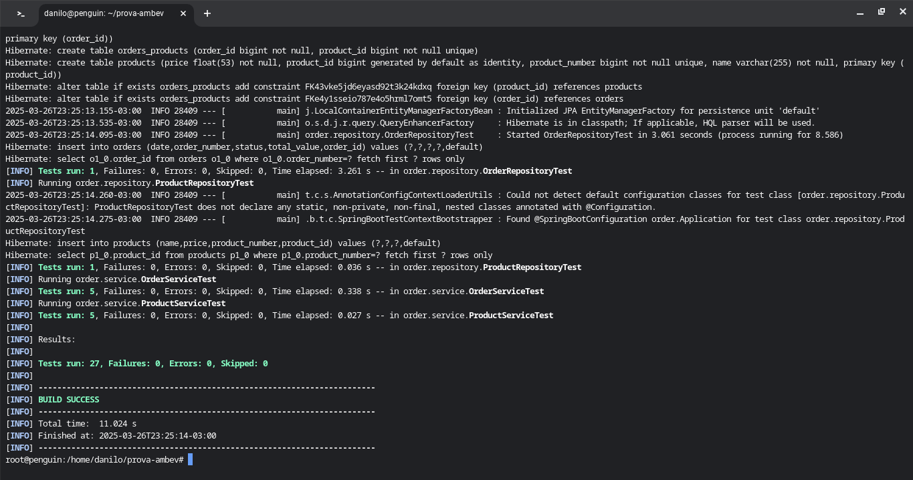

# Prova Ambev

Avaliação técnica de uma API de Cadastro de Pedidos, desenvolvido em Java com Spring-Boot.

## Características

- API RESTful
- Validation
- MockMVC

## Requisitos

- Java JDK 21
- Apache Maven >= 3.9.8
- MySql 8
- Docker (Opcional)

## Tecnologias

- Java
- JPA
- Hibernate
- Maven
- Spring
- Lombok
- Jakarta
- XML
- JSON
- MySql
- JUnit
- Docker

## Instalação

```
$ git clone https://github.com/danilomeneghel/prova-ambev.git

$ cd prova-ambev
```

## MySql

Abra seu MySql e crie a base de dados:

prova_ambev


## Maven

Para carregar o projeto, digite no terminal:

```
$ mvn clean spring-boot:run -Dspring-boot.run.profiles=dev
```

Aguarde carregar todo o serviço web. <br>
Após concluído, digite o endereço abaixo em seu navegador, nele será listado os pedidos
cadastrados na API. <br>

http://localhost:8080/order


## Docker (Opcional)

Para rodar o projeto via Docker, bastar executar o seguinte comando:

```
$ docker build -t projeto .
$ docker run -p 8080:8080 -d projeto
```

Ou via Docker-Compose:

```
$ docker compose up
```

Aguarde baixar as dependências e carregar todo o projeto, esse processo é demorado. <br>
Caso conclua e não rode pela primeira vez, tente novamente executando o mesmo comando. <br>

Para encerrar tudo digite:

```
$ docker compose down
```


## Swagger

Documentação da API RESTful:

http://localhost:8080/swagger-ui.html


## Testes

Para realizar os testes, execute o seguinte comando no terminal:

```
$ mvn test
```

## Screenshots

Swagger-UI <br>
 <br><br>

Modelagem ER <br>
 <br><br>

Banco de Dados <br>
 <br><br>
 <br><br>
 <br><br>

Testes Unitários <br>
 <br><br>


## Licença

Projeto licenciado sob <a href="LICENSE">The MIT License (MIT)</a>.<br><br>


Desenvolvido por<br>
Danilo Meneghel<br>
danilo.meneghel@gmail.com<br>
http://danilomeneghel.github.io/<br>
