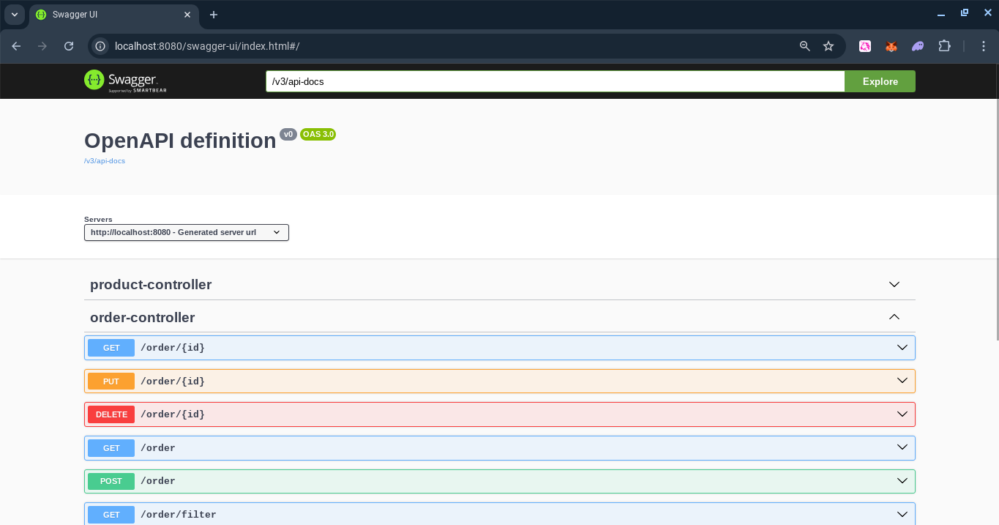
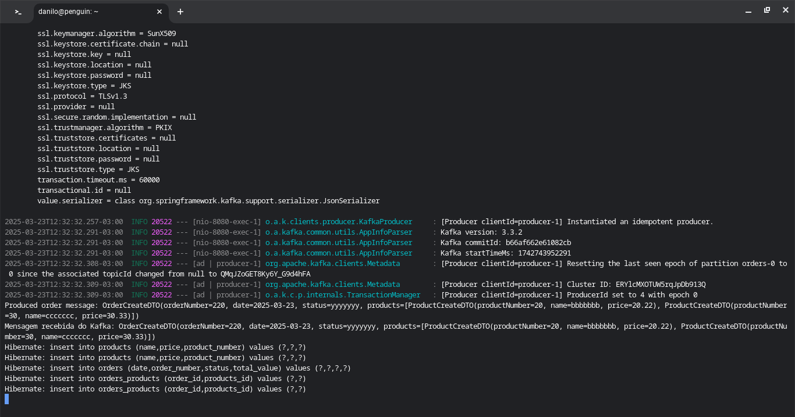

# Prova Ambev

Avaliação técnica de uma API de Cadastro de Pedidos, desenvolvido em Java com Spring-Boot.


## Características

- API RESTful
- Validation
- MessageQueue
- MockMVC


## Requisitos

- Java JDK 21
- Apache Maven >= 3.9.8
- MySql 8
- Zookeeper 3.8.0
- Kafka 3.3.2
- Docker (Opcional)


## Tecnologias

- Java
- JPA
- Hibernate
- Maven
- Spring
- Lombok
- Jakarta
- JSON
- MySql
- JUnit
- Kafka
- Docker


## Instalação

```
$ git clone https://github.com/danilomeneghel/prova-ambev.git

$ cd prova-ambev
```


## MySql

Abra seu MySql e crie a base de dados:

prova_ambev


## Kafka

Primeiro rode o Kafka.<br>
Caso não tenha o Kafka instalado, execute o seguinte comando via Docker:

```
docker network create app-tier --driver bridge
docker run -d --name zookeeper-server --network app-tier -e ALLOW_ANONYMOUS_LOGIN=yes bitnami/zookeeper:3.8.0
docker run -d --name kafka-server --network app-tier -p 9092:9092 -e ALLOW_PLAINTEXT_LISTENER=yes -e KAFKA_CFG_ZOOKEEPER_CONNECT=zookeeper-server:2181 -e KAFKA_CFG_ADVERTISED_LISTENERS=PLAINTEXT://127.0.0.1:9092 -e KAFKA_CFG_LISTENERS=PLAINTEXT://0.0.0.0:9092 bitnami/kafka:3.3.2
docker run -it --rm --network app-tier -e KAFKA_CFG_ZOOKEEPER_CONNECT=zookeeper-server:2181 bitnami/kafka:3.3.2 kafka-topics.sh --list --bootstrap-server kafka-server:9092
```


## Maven

Para carregar o projeto, digite no terminal:

```
$ mvn clean spring-boot:run -Dspring-boot.run.profiles=dev
```

Aguarde carregar todo o serviço web. <br>
Após concluído, digite o endereço abaixo em seu navegador, nele será listado os pedidos
cadastrados na API. <br>

http://localhost:8080/order


## Docker (Opcional)

Para rodar o projeto via Docker, bastar executar o seguinte comando:

```
$ docker build -t projeto .
$ docker run -p 8080:8080 -d projeto
```

Ou via Docker-Compose:

```
$ docker compose up
```

Aguarde baixar as dependências e carregar todo o projeto, esse processo é demorado. <br>
Caso conclua e não rode pela primeira vez, tente novamente executando o mesmo comando. <br>

Para encerrar tudo digite:

```
$ docker compose down
```


## Swagger

Documentação da API RESTful:

http://localhost:8080/swagger-ui.html


## Testes

Para realizar os testes, execute o seguinte comando no terminal:

```
$ mvn test
```


## Uso da Messageria Kafka

Ao utilizar o Apache Kafka para lidar com alta disponibilidade e alto volume de dados, a melhor opção geralmente é priorizar o envio dos dados para o Kafka antes de persistir no banco de dados. Essa abordagem aproveita as características do Kafka para garantir a resiliência e a escalabilidade do sistema.<br> 

Vantagens de Enviar para o Kafka Primeiro:<br> 

- Alta Disponibilidade e Tolerância a Falhas<br>
O Kafka é projetado para ser altamente distribuído e tolerante a falhas.<br> 
Ao replicar dados entre brokers, ele garante que os dados não sejam perdidos, mesmo se um ou mais brokers falharem.<br>
Isso é crucial em cenários de alto volume, onde a perda de dados pode ter impactos significativos.<br>

- Escalabilidade<br>
O Kafka permite escalar horizontalmente, adicionando mais brokers ao cluster conforme necessário.<br> 
Isso o torna ideal para lidar com volumes crescentes de dados.<br>
Essa escalabilidade garante que o sistema possa manter o desempenho mesmo sob cargas pesadas.<br>

- Desacoplamento e Processamento Assíncrono<br>
O Kafka desacopla os produtores de dados dos consumidores, permitindo que os dados sejam processados de forma assíncrona.<br>
Isso melhora o desempenho geral do sistema, pois os produtores não precisam esperar que os dados sejam persistidos no banco de dados antes de continuar.<br>

- Retenção de Dados<br>
O Kafka armazena os dados por um período configurável, permitindo que os consumidores processem os dados em seu próprio ritmo e até mesmo reprocessem os dados se necessário.


## Screenshots

Swagger-UI <br>
 <br><br>

Modelagem ER <br>
 <br><br>

Testes Unitários <br>
 <br><br>

Aplicação Spring Boot <br>
 <br><br>


## Licença

Projeto licenciado sob <a href="LICENSE">The MIT License (MIT)</a>.<br><br>


Desenvolvido por<br>
Danilo Meneghel<br>
danilo.meneghel@gmail.com<br>
http://danilomeneghel.github.io/<br>
